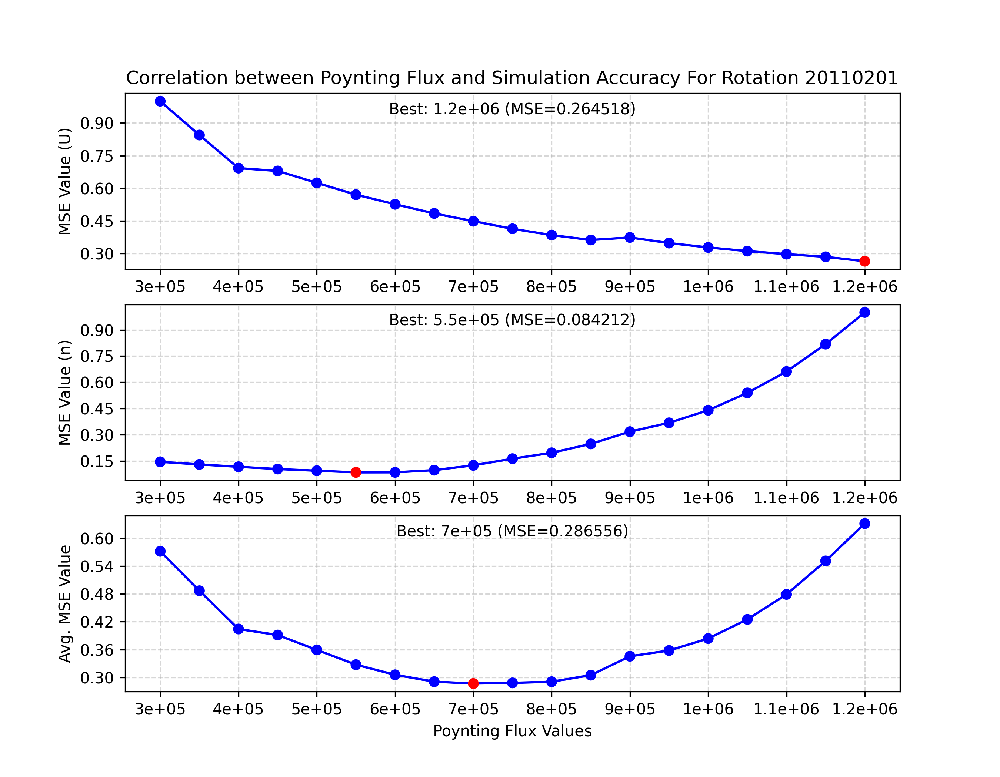

# AWsoMVisualizer
**An AWsoM Solar Wind Simulation Result Visualization Tool**


## About
This utility can plot and visualize simulation data from the AWsoM Solar Wind Model. It is able to create plots for several variables on hundreds of simulation runs at once and compare them to real OMNI observation data from [NASA's CDAWeb](https://cdaweb.gsfc.nasa.gov/).


Additionally, analysis plots that show the best Poynting Flux parameter value for different Carrington rotation simulation runs will also be generated.



The best run results for each rotation are calculated by the following steps:
1. The simulation data is interpolated onto the actual data.
2. The difference (see [difference calculation methods](#difference-calculation-methods)) for each run is calculated between the simulation and actual data. Difference values are normalized in each subplot for consistent comparison.
3. The important parameters specified in config_local.py are used to find overall difference values for each run across variables.
4. The simulation runs are ranked by difference values and the lowest difference value run is determined.

## Setup
To setup, first make a copy of the repository:

```
git clone https://github.com/somewhatalex/AWsoMVisualizer.git
```

Next, please install the following Python libraries. You should also have [Python 3.12](https://www.python.org/downloads/) or higher installed.
```
pip install -u xarray cdflib cdasws matplotlib numpy scipy tqdm
```
Customizable user preferences can be found in [config_local.py](config_local.py). "config_local.py" contains a Python dict of editable values. The presets can be edited before running the program.

## Usage
You will need a folder containing properly-formatted simulation data, an example of which can be found [here](./examples/run001_AWSoM/).

To run the program:
```
python plot_simulation.py
```

All plots will be saved to your device in the folders specified via [config_local.py](config_local.py). The preset is `./output_plots`.

### Program Flags
| Option     | Description                                       |
|------------|---------------------------------------------------|
| -h, --help | Display this help message                   |
| -t       | Specify rotation date to plot (ex. 20120516)                     |
| -sp     | Set  simulation path, default is ./simulations  |
| -o       | Set folder to output plots, default is ./output_plots|
| -showplot  | Opens graph(s) as a new window when script finishes  |
| -m  | Specifies method to calculate difference between sim and actual data, default is "mse"  |

### Difference Calculation Methods
| -m [input]     | Description                                       |
|------------|---------------------------------------------------|
| mse | Mean squared error |
| mae | Mean absolute error |
| curve_distance | Curve distance  |
| scc | Spearman correlation coefficient  |